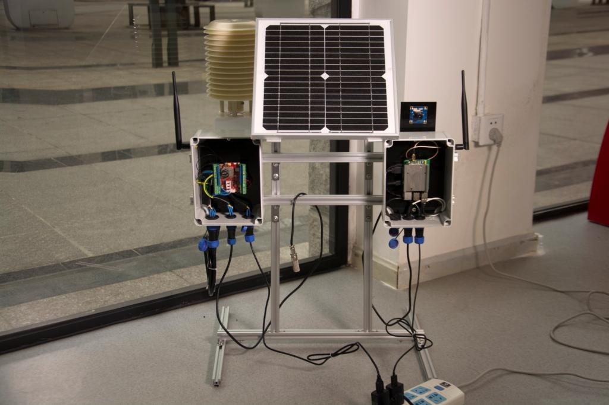
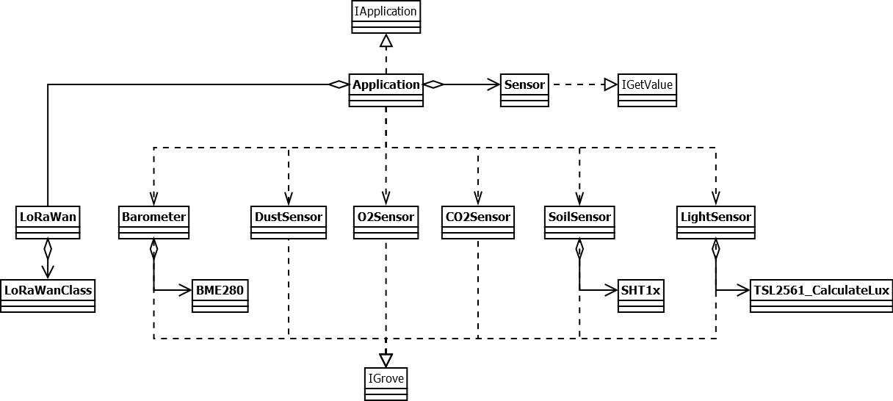

# Seeed IoTea LoRa Solution

*Internet+* is a popular concept now. This time we tried the Internet plus agriculture to make tea garden grows out the Internet Tea.

## Things used in this project

### Hardware components

- LoRa/LoRaWAN Gateway Kit
- Grove - Barometer Sensor(BME280)
- Grove - Dust Sensor
- Grove - Gas Sensor(O₂)
- Grove - CO2 Sensor 
- Grove - Digital Light Sensor
- Soil Moisture & Temperature Sensor
- USB Camera
 
### Software apps and online services

- Microsoft Visual Studio 2015

## Story

On Mengding Mountain northeast of Ya’an, Sichuan, the mountain ridge runs west to east in a sea of green. This is a most familiar sight for 36-year-old Deng, one of the very few Mengding tea makers of his generation, with a plantation of 50mu (=3.3 hectares) situated at 1100m above sea level. Deng comes from a family of tea makers, but carrying on the family legacy is not an easy task. “Our teas are grown at high altitude in an organic environment to ensure its excellent quality. But at the same time, the growth density is low, cost is high and budding is uneven, making tea hard to harvest. That’s why high-mountain teas are normally small harvests and their values are not reflected on the market.”For the past two years, Deng has been trying to raise consumer awareness of high-mountain tea to promote their value. And when he met Fan, who was looking for a plantation to implement Seeed’s IoTea technology, a perfect match for a solution was made.

### Hardware Connection

The hardware of this project can be splitted to 4 parts: Power, Sensors, Node and Gateway. Following article will show you how to complete it step by step.

**Power Part**

Power Part mainly contains a Solar Panel and a Lithium Battery, if you just build this project for demonstration, you can ignore them. Or you can follow [Previous tutorial](https://project.seeedstudio.com/SeeedStudio/seeed-lora-iotea-solution-b5ee95) to install node power.

**Sensor Part**

In Sensor Part, because of the many of sensors, we used a weather station, and also made a Acrylic bracket to install them.

As you see in the picture above, Digital Light Sensor always on the top, so that it can collect lighting infomation. The sensors that will generate heat are installed in middle of the Acrylic bracket, such as O2 Sensor, Dust Sensor and CO2 Sensor. At last, Temperature and Humidity Sensor on the bottom of Acrylic bracket.

Besides, Soil Temperature and Humidity Sensor is installed alone in the soil.

**Node Part**

Node Part is a Seeeduino LoRaWan which installed in a Waterproof Box, it connect to power and sensors via Water Joints. Among them, Dust Sensor connect to LoRaWan's digital pin D3, CO2 Sensor connect to pin D4 & D5, Soil Sensor connect to pin D6 & D7, O2 Sensor connect to analog pin A1 and Light Sensor & Barometer Sensor connect to I2C port.

*NOTE: A 10k Resistor should be added between Soil Sensor's Blue(Data) cable and Red(Vcc) cable.*

Seeeduino LoRaWan collect sensors value once in a while, and send them to Gateway via LoRa. The data format like below:

    {
    	[0],	/* Air tempreature(℃)						*/
    	[1],	/* Air humidity(%)							*/
    	[2],	/* Altitude(m) high byte					*/
    	[3],	/* Altitude(m) low byte						*/
    	[4],	/* CO2 concentration(PPM) high byte			*/
    	[5],	/* CO2 concentration(PPM) low byte			*/
    	[6],	/* Dust concentration(pcs/0.01cf) high byte	*/
    	[7],	/* Dust concentration(pcs/0.01cf) low byte	*/
    	[8],	/* Light intensity(lux) high byte			*/
    	[9],	/* Light intensity(lux) low byte			*/
    	[10],	/* O2 concentration(%)						*/
    	[11],	/* Soil temperature(℃)						*/
    	[12],	/* Soil humidity(%)							*/
    	[13],	/* Battery voltage(V)						*/
    	[14]	/* Sensor error code						*/
    }

Each bit in Sensor Error Code byte has a difference meaning, just like below:

    {
    	bit0: 1;		/* Barometer Sensor Error			*/
    	bit1: 1;		/* CO2 Sensor Error					*/
		bit2: 1;		/* Dust Sensor Error				*/
		bit3: 1;		/* Light Sensor Error				*/
		bit4: 1;		/* O2 Sensor Error					*/
		bit5: 1;		/* Soil Sensor Error				*/
		reserved: 2;	/* Reserved							*/
    }

**Gateway Part**

Gateway Part is a Raspberry Pi which plugged Gateway module RHF0M301–868 and PRI 2 Bridge RHF4T002, it installed in a Waterproof Box and connect to power & USB Camera via Water Joints. Because it use specialized firmware, please follow [Seeed Wiki](http://wiki.seeedstudio.com/LoRa_LoRaWan_Gateway_Kit/) to configure it.

### Software Programming

As Hardware Connection, Software Programming also can be splitted, it can be splitted to 3 parts: Node, Gateway and Website.

**Node Part**

Most of drivers that Node Part required are already contained in `origin_driver` folder. The libraries following down need to be installed manually: 

- [Adafruit_ASFcore](https://github.com/adafruit/Adafruit_ASFcore)

Because the project is complicated, we recommend you use Microsoft Visual Studio instead of Arduino IDE. A plugin called Visual Micro can help you biuld an Arduino project by using Visual Studio, click [here](https://www.visualmicro.com/) for more information.

For better readability and maintainability, we use Object-Oriented Programming this time. The class diagram of this project looks like below:

For those sensors already have OOP driver, we repacked it to adapt this project, for others, we rewrote their drivers by using OOP. The Sensor class in middleware layer is used to unify interfaces of real sensors, for example, a barometer sensor can collect temperature, humidity and altitude at the same time, so it has 3 interfaces to acquire temperature, humidity and altitude. But they have difference method name, which will make the program of acquiring sensors value more complicated, just like this:

    barometer->getTemperature();
    barometer->getHumidity();
    barometer->getAltitude();
    // ...
    another_sensor->getSomeValue();
    // ...

But using OOP, it looks like this:

    for (auto i = 0; i < SENSORS_COUNT; i++) {
    	sensors[i]->getValue();
    }

We also packed an Application class, it implement IApplication interface, the setup() and loop() method in IoTea.ino can call setup() and loop() method in Application object.

*NOTE: USB Serial is used to debug ONLY. After debugging, please comment it's initialize code in setup() method.*

**Gateway Part**

Gateway Part's Python program in home folder is used to take photos and upload them to Amazon S3 Server every hour. Before you use it, make sure fswebcam already installed in your Raspberry Pi: 

	sudo apt-get update && sudo apt-get install fswebcam 

If you want to upload photos, configure your AWS by following steps. First, install AWS SDK and AWS CLI to your Raspberry Pi by using these commands: 

	sudo pip install boto3
    sudo pip install awscli

and then, run AWS CLI:

    sudo aws configure

Configure your AWS Access Key ID, AWS Secret Access ID and Default region name. 

If you don't like to upload your photos, you can skip AWS configuration steps and comment codes about uploading in photo.py. For running this program after booting Raspberry Pi every time, you can create a file name photo in /etc/init.d, and write the following code to it.

    #!/bin/bash
    # /etc/init.d/photo
     
    ### BEGIN INIT INFO
    # Provides: seeed_photo
    # Required-Start: $remote_fs $syslog
    # Required-Stop: $remote_fs $syslog
    # Default-Start: 2 3 4 5
    # Default-Stop: 0 1 6
    # Short-Description: photo taking initscript
    # Description: This service is used to manage photo taking
    ### END INIT INFO
     
    case "$1" in
    start)
    echo "Start taking photo"
    /home/rxhf/photo.py &
    ;;
    stop)
    echo "Stop taking photo"
    kill $(ps aux | grep -m 1 'python3 /home/rxhf/photo.py' | awk '{ print $2 }')
    ;;
    *)
    echo "Usage: service photo start|stop"
    exit 1
    ;;
    esac
    exit 0

set execution permission

	sudo chmod 777 /etc/init.d/photo
	sudo chmod 777 /home/rxhf/photo.py

and test it

	sudo /etc/init.d/photo start

If there is no problem, stop it and add it to startup application

	sudo /etc/init.d/photo stop
	sudo update-rc.d photo defaults

*NOTE: If you want to startup gateway after Raspberry Pi booting, add gateway starting codes in Seeed Wiki to /etc/rc.local, let it lokks like:*

	#!/bin/sh -e
	#
	# rc.local
	#
	# This script is executed at the end of each multiuser runlevel.
	# Make sure that the script will "exit 0" on success or any other
	# value on error.
	#
	# In order to enable or disable this script just change the execution
	# bits.
	#
	# By default this script does nothing.
	
	# Print the IP address
	_IP=$(hostname -I) || true
	if [ "$_IP" ]; then
	  printf "My IP address is %s\n" "$_IP"
	fi
	
	cd /home/rxhf/loriot/1.0.2
	sudo systemctl stop pktfwd
	sudo gwrst
	wget https://cn1.loriot.io/home/gwsw/loriot-risinghf-rhf2s008-rhf1257-SPI-0-latest.bin -O loriot-gw.bin
	chmod +x loriot-gw.bin
	./loriot-gw.bin -f -s cn1.loriot.io
	
	exit 0

**Website**

We deployed the website on CentOS7. Following steps will show you how to deploy.

Step 1. Install Python3

	sudo yum -y install epel-release
	sudo yum -y install python36

Step 2. Install Python pip and virtual enviroment

	wget https://bootstrap.pypa.io/get-pip.py
	sudo python36 get-pip.py
	sudo pip install virtualenv

Setp 3. Clone our website from GitHub

	sudo yum -y install git
	git clone https://github.com/SeeedDocument/iotea-hb.git

Step 4. Create and activate virtual enviroment

	virtualenv -p python36 iotea-hb
	cd iotea-hb
	source bin/activate

Step 5. Install dependent libraries

	pip install pymysql
	pip install dbutils
	pip install flask
	pip install websocket-client
	pip install cofigparser

Step 6. Create database

	sudo yum -y install mariadb mariabd-server
	sudo systemctl enable mariadb
	sudo systemctl start mariadb
	mysql -uroot -p

and then use iotea_hb.sql to create a table.

Step 7. Create db.ini, and write these codes to it

    [db]
    db_port = 3306
    db_user = root
    db_host = localhost
    db_pass = 
    db_name = iotea

change db.ini's path in db.py

	# in db.py
	#cf.read("/data/www/python3_iotea_hb/iotea/conf/db.ini")
	cf.read("/home/<your_username>/iotea-hb/db.ini")

Step 8. Change port in app.py and start the website: 

	# in app.py
	#app.run(debug=True, port=6000)
	app.run(debug=True, port=8080)

	# in terminal
	pip install gunicorn
	gunicorn -w 5 -b 0.0.0.0:8080 app:app

now visit 127.0.0.1:8080 in your web browser, you can see the website, but real-time data is not displayed.

Step 9. Get loriot data

Open another terminal, reenter virtual enviroment and start loriot app: 

	cd iotea-hb
	source bin/activate
	gunicorn loriot:app 

Wait for a while, you will see data displayed in website, or you can change wss in loriot.py:

	# in loriot.py
	#ws = create_connection("wss://cn1.loriot.io/app?token=vnwEuwAAAA1jbjEubG9yaW90LmlvRpscoh9Uq1L7K1zbrcBz6w==")
	ws = create_connection(<your_wss>)

## Operation

You can visit our websites to view real-time data:

- [In Yaan](https://iotea.seeed.cc/)
- [Demonstration](https://iotea-hb.seeed.cc/)

[Video](https://www.youtube.com/watch?v=4df5kaaKa6I&feature=youtu.be)