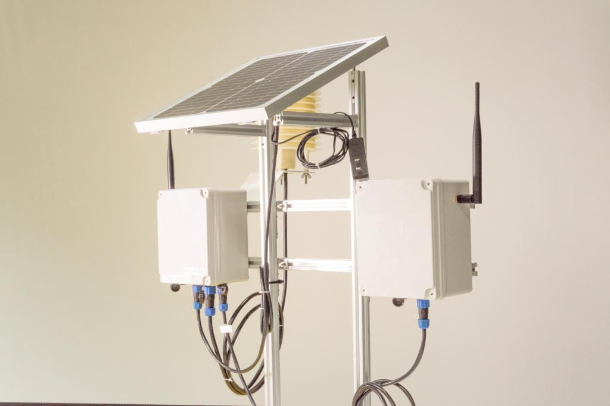
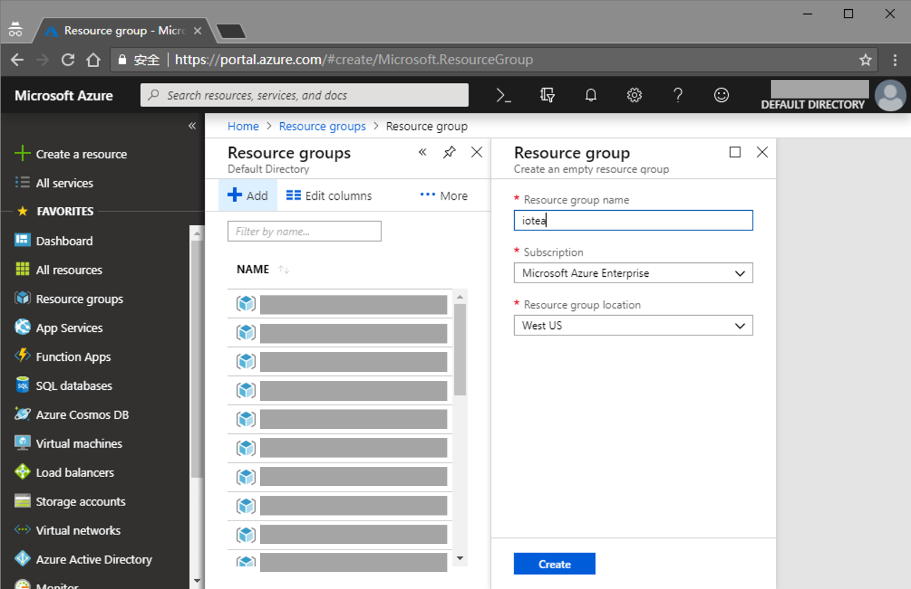
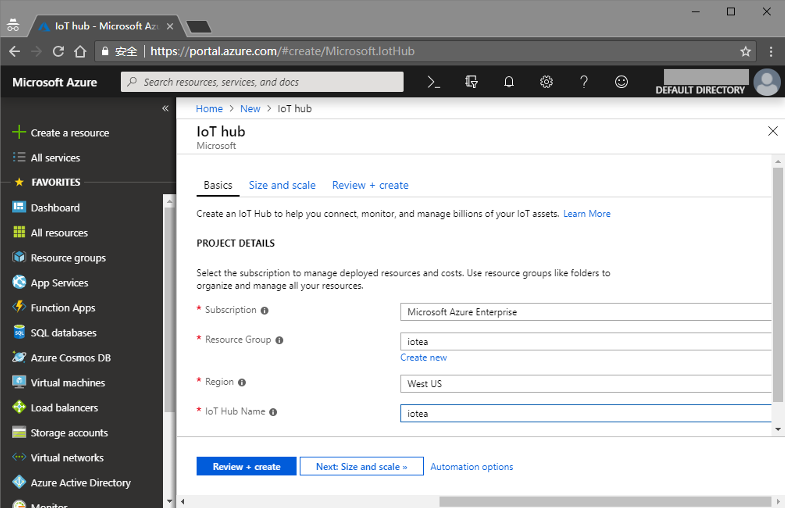
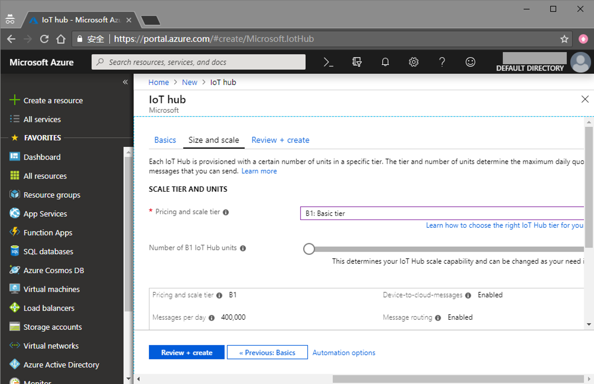
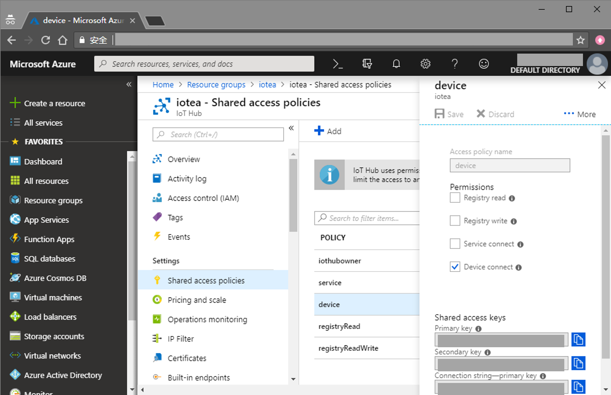
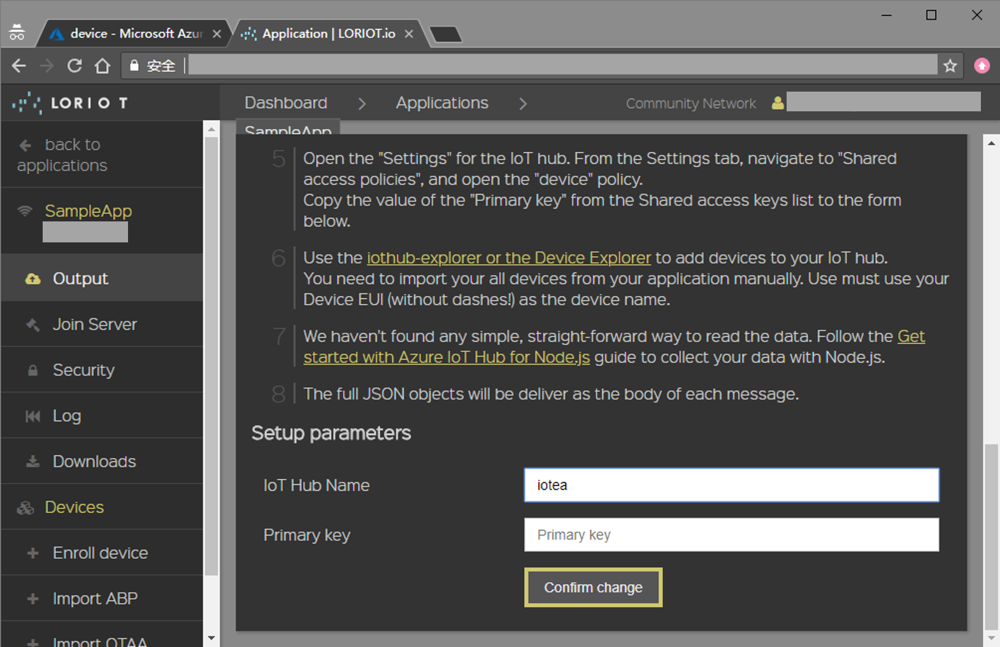
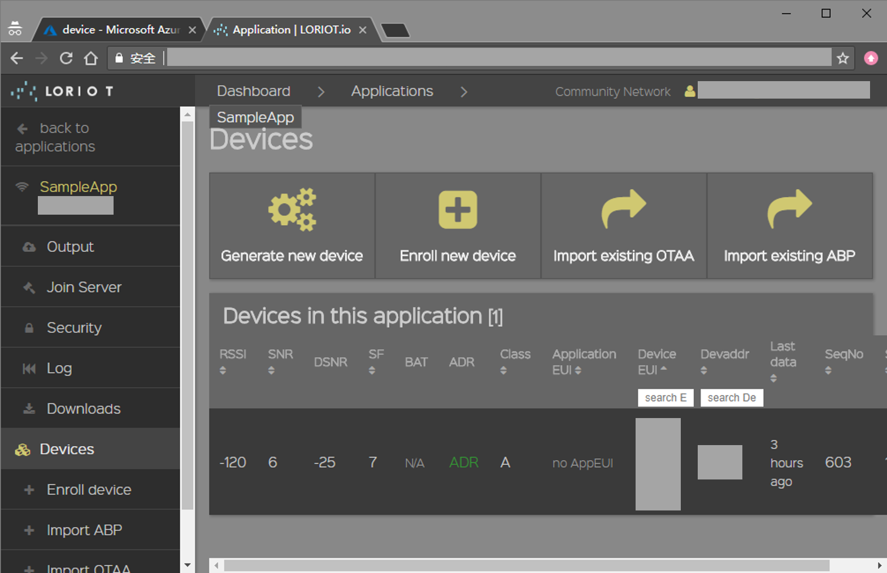
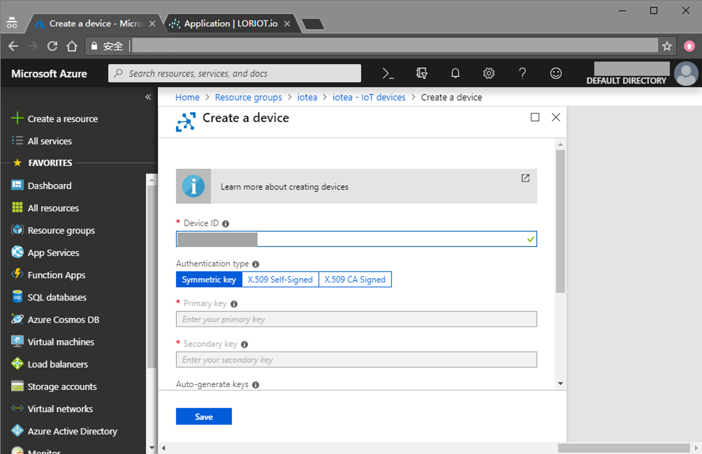
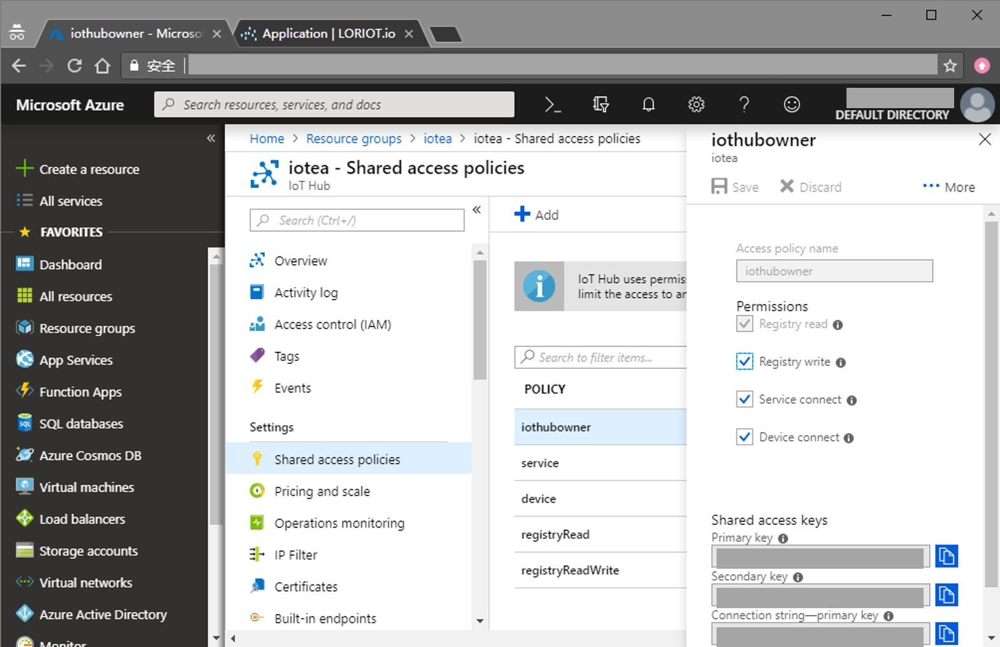

# Seeed IoTea LoRa Solution (with Azure, Update 1812)

Microsoft Azure is a Cloud Service which provide more powerful and stable computing power, this time we tired send our IoTea data to it.

## Things used in this project
### Hardware components
- Seeed LoRa LoRaWAN Gateway - 868MHz Kit with Raspberry Pi 3
- Seeed Grove - Temp&Humi&Barometer Sensor (BME280)
- Seeed Grove - Dust Sensor（PPD42NS）
- Seeed Grove - Oxygen Sensor(ME2-O2-Ф20)
- Seeed Grove - Carbon Dioxide Sensor(MH-Z16)
- Seeed Grove - Digital Light Sensor
- Seeed Soil Moisture & Temperature Sensor
- USB Camera
### Software apps and online services
- Microsoft Visual Studio 2015
- Microsoft Azure

## Story
On Mengding Mountain northeast of Ya’an, Sichuan, the mountain ridge runs west to east in a sea of green. This is a most familiar sight for 36-year-old Deng, one of the very few Mengding tea makers of his generation, with a plantation of 50mu (=3.3 hectares) situated at 1100m above sea level. Deng comes from a family of tea makers, but carrying on the family legacy is not an easy task. “Our teas are grown at high altitude in an organic environment to ensure its excellent quality. But at the same time, the growth density is low, cost is high and budding is uneven, making tea hard to harvest. That’s why high-mountain teas are normally small harvests and their values are not reflected on the market.”For the past two years, Deng has been trying to raise consumer awareness of high-mountain tea to promote their value. And when he met Fan, who was looking for a plantation to implement Seeed’s IoTea technology, a perfect match for a solution was made.

### Hardware Connection
Please follow [Previous Tutorial](https://project.seeedstudio.com/SeeedStudio/seeed-iotea-lora-solution-update-1811-860035) to connect your hardware.

### Cloud Configure
**Step 1. Create Resource Group**

Click [here](https://portal.azure.com) to login Microsoft Azure. And then, enter Resource groups in list on the left of dashboard, click Add to add a Resource Group.

A Resource Group is used to manage all resources in project, after using cloud resources, delete resource group to delete all resources to avoid charges. In opened page, fill Resource group name(such as iotea), choose Subscription and Resource group location if needed, click Create to create a Resource Group. 

**Step 2. Create Iot Hub**

Now you can create a cloud resource, click Create a resouce on the left, choose Internet of Things - Iot Hub, it will open a new page.

In Basics tab, choose the Resource Group you just created, and fill Iot Hub Name(such as iotea), choose Subscription and Region if needed, and then turn to Size and scle tab.

In Size and scale tab, choose F1: Free tier or B1: Basic tier in Pricing and scale tier combo, Basic Tier will take 10.00 USD per month. Finally, turn to Review + create tab check you input and click Create to create a Iot Hub.

**Step 3. Configure LORIOT**

Enter the Iot Hub you just create, click Shared access policies - device, copy the Primary key in page on the right.

Open a new brower window(or tab), login your LORIOT Control Panel, turn to Application - SampleApp, click Data output in Control group - Change. In Change output type group, choose Azure Iot Hub, fill your Iot Hub Name and Primary key, and click Confirm change button on the bottom.

**Step 4. Add Iot device**

Click Devices in list on the left in LORIOT, copy your Device EUI.

Back to Azure Iot Hub, click Iot devices in the list on the left of Iot Hub. Click Add, fill Device EUI to Device ID in opened page.

*IMPORTANT: DELETE ALL SEPRATOR IN DEVICE EUI, let it looks like 1122334455667788.*

Click Save, all done.

**Step 5. Receive D2C(Device to Cloud) Messages**

You can follow [Microsoft Docs](https://docs.microsoft.com/en-us/azure/iot-hub/quickstart-send-telemetry-dotnet#read-the-telemetry-from-your-hub) to read D2C Messages.

### Software Programming

Software Programming is splitted to 3 parts: Node, Gateway and Website, please follow [Previous Tutorial](https://project.seeedstudio.com/SeeedStudio/seeed-iotea-lora-solution-update-1811-860035) to program Node Part and Gateway Part. Steps 1 through 8 of the Website Part are also same as [Previous Tutorial](https://project.seeedstudio.com/SeeedStudio/seeed-iotea-lora-solution-update-1811-860035).

If you already configured Microsoft Azure, open a terminal, enter your website's root folder, activate virtual enviroment:

	cd ~/iotea-hb
	source bin/activate

install Azure Event Hub module via pip, and create a new .py file(such as iothub_recv.py):

	pip install azure-eventhub
	touch iothub_recv.py

and then write codes following down to it:

	# --------------------------------------------------------------------------------------------
	# Copyright (c) Microsoft Corporation. All rights reserved.
	# Licensed under the MIT License. See License.txt in the project root for license information.
	# --------------------------------------------------------------------------------------------
	
	from azure import eventhub
	from azure.eventhub import EventData, EventHubClient, Offset
	
	import logging
	logger = logging.getLogger('azure.eventhub')
	
	import db, json, time, datetime
	
	
	def get_time():
		cntime = datetime.datetime.now() + datetime.timedelta(hours = +8)
		
		date = cntime.strftime('%Y-{}-{}').format(cntime.strftime('%m').zfill(2), cntime.strftime('%d').zfill(2))
		
		hour = cntime.strftime('%H').zfill(2)
		minute = cntime.strftime('%M').zfill(2)
		second = cntime.strftime('%S').zfill(2)
		
		return [date, hour, minute, second]
	
	
	def get_iothub_data():
		list = ['0'] * 11
		
		client = EventHubClient.from_iothub_connection_string('<your_connection_string>', debug=True)
		receiver = client.add_receiver("$default", "3", operation='/messages/events', offset = Offset(datetime.datetime.utcnow()))
		
		try:
			client.run()
			eh_info = client.get_eventhub_info()
			print(eh_info)
			
			received = receiver.receive(timeout=5)
			print(received)
			
			for item in received: 
				message = json.loads(str(item.message))
				print(message)
				
				if 'data' in message:
					data = message['data']
					
					air_temp = str(int(data[0:2], 16))
					air_hum = str(int(data[2:4], 16))
					pressure = str(int((data[4:8]), 16))
					co2 = str(int(data[8:12], 16))
					dust = str(int(data[12:16], 16))
					illumination = str(int(data[16:20], 16))
					o2 = str(round(int(data[20:22], 16) / 10, 1))
					soil_temp = str(int(data[22:24], 16))
					soil_hum = str(int(data[24:26], 16))
					voltage = str(round(int(data[26:28], 16) / int('ff', 16) * 5, 1))
					error = str(int(data[28:], 16))
					
					list = [air_temp, air_hum, pressure, co2, dust, illumination, o2, soil_temp, soil_hum, voltage, error]
		
		finally:
			client.stop()
		
		return list
	
	
	while True:
		list = get_time() + get_iothub_data()
		db.insert(list)
		print(list)

Before you running the program, change your connection string in 

	client = EventHubClient.from_iothub_connection_string('<your_connection_string>', debug=True)

you can get your connection string by clicking Shared access policies - iotowner in Iot Hub, the Connection string-primnary key in opened page is the connection string.

After that, you can start the program:

	gunicorn iothub_recv:app
